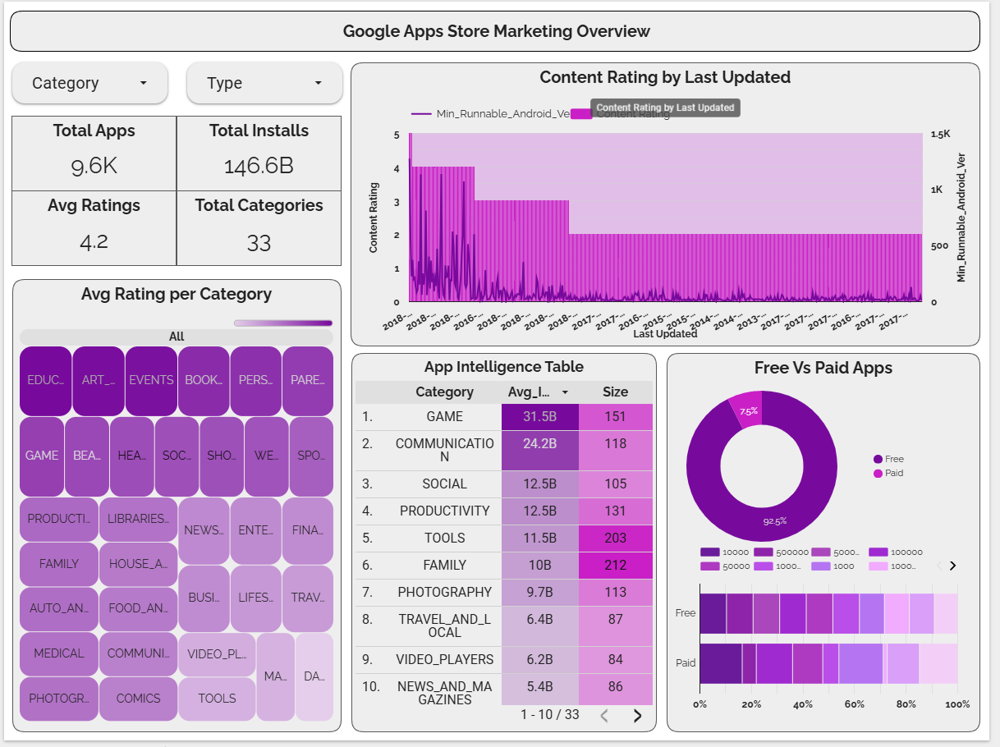

# Google Play Store Market Intelligence Dashboard
## Overview

This interactive Looker Studio dashboard examines a curated dataset of 10,300 cleaned Google Play Store apps, delivering real-time analytics on key metrics such as user ratings, installation volumes, category-level performance, and emerging market trends. It equips stakeholders with actionable intelligence to guide strategic decisions in app development, feature prioritization, and marketing initiatives.

---

## Dataset

> Original Dataset - `googleplaystore.csv`

The analysis is based on a refined dataset comprising **10,300 Google Play Store applications**, derived from the original source through rigorous data cleaning—including duplicate removal and imputation of missing values. This curated dataset (`googleplaystore.csv`) was produced using the preprocessing pipeline documented in `Google_Play_Store_Analytics_Cleaned_Data.ipynb`. Key descriptive statistics reveal an **average app rating of 4.2**, with **92.6% of apps offered free of charge** and an **average of 14.2 million installs per app**. The apps span **33 distinct categories**, with **GAME** dominating at **21.51% of total installs**, closely followed by **COMMUNICATION** and **SOCIAL**, each accounting for **8.53%**. Install volumes are grouped into four tiers: **Very High** (>1M installs; 4,059 apps), **High** (100K–1M; 1,645 apps), **Medium** (1K–100K), and **Low** (<1K). User ratings are further classified into five performance bands—**Excellent** (4.5–5.0), **Very Good** (4.0–4.5), **Good** (3.0–4.0), **Fair** (2.0–3.0), and **Poor** (≤2.0)—to enable nuanced evaluation. The dataset covers apps released between **2010 and 2018**, capturing temporal trends in app launches, updates, and market evolution over nearly a decade.

---

## Analysis

  - Performed comprehensive data cleaning in a Jupyter notebook using Python, addressing missing ratings, converting app size and install counts into numeric formats, and eliminating duplicate entries.  
  - Exported the refined dataset to `googleplaystore.csv` to support seamless integration with Looker Studio, ensuring reliability and uniformity for downstream visualization.  
  - Normalized key fields—including category labels, price representations, and date formats—to facilitate precise filtering, grouping, and aggregation within the dashboard. 
  - Integrated dynamic filters for **Category** and **App Type** (Free/Paid), allowing users to explore performance metrics within specific market segments.  
  - Developed a stacked bar chart visualizing **rating distribution across install tiers**, highlighting that apps in the Very High install group have 44.19% rated as Very Good.  
  - Built a time-series view showing the **distribution of app records by rating year-over-year (2010–2018)**, which identified 2017–2018 as periods of peak activity and quality improvements.
  - The **GAME** category leads significantly in both total app volume and install share, reinforcing its strategic importance for future development investment.  
  - Apps with higher install volumes tend to receive better ratings—**35.75% of Very High install apps are rated Excellent**, compared to only **5.08% in the Low install segment**.  
  - **Free apps represent 92.6% of the ecosystem**, underscoring the prevalence of the freemium model and the need to optimize in-app monetization and user retention.  
  - Overall **rating quality has improved over time**, with apps released between 2016 and 2018 showing notably higher proportions of Good and Very Good ratings than earlier cohorts.

---

## Dashboard

- This dashboard delivers a high-level, real-time overview of the Google Play Store ecosystem, based on an analysis of 9.6K cleaned applications.
- Key metrics include an **average app rating of 4.2**, **146.6 billion total installs**, and **92.2% of apps being free**, reflecting the dominance of the freemium model.
- The **App and Reviews by Last Updated** line chart tracks release and update trends from 2010 to 2018, revealing steady growth in both app volume and user reviews over time.
- A treemap highlights the **Top 10 Categories by App Count**, with FAMILY and GAME categories leading the market, followed by TOOLS and COMMUNICATION.
- The **Content Rating Distribution** donut chart shows that 80.9% of apps are rated “Everyone,” while only 11.1% target “Teen” audiences—indicating broad accessibility across age groups.
- The **Free vs Paid Apps by Category** stacked bar chart compares monetization strategies across categories, illustrating how most categories are overwhelmingly dominated by free offerings.
- Interactive filters for **Category** and **Type** empower stakeholders to drill into specific segments, enabling targeted analysis for product strategy, marketing, and user acquisition planning.

<h1>

[Click here for Direct Link to Dashboard](https://lookerstudio.google.com/reporting/26f3c8eb-79d8-40f6-848b-b61473c93dd1)

  
</h1>  

---

---

## Author & Contact
- Name: `Kshitij Saini`    
- LinkedIn: [https://www.linkedin.com/in/kshitijsaini](https://www.linkedin.com/in/kshitij-saini-b950b7299?utm_source=share_via&utm_content=profile&utm_medium=member_android)
